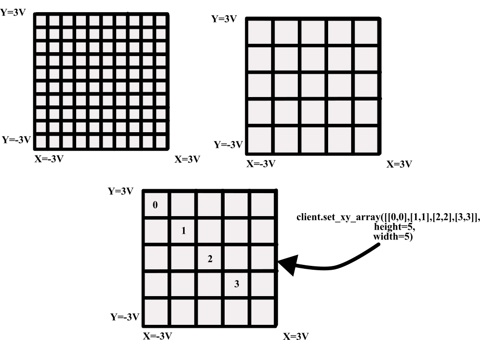

.. _scan-design:

#####################
DE-Freescan Design
#####################

This document describes the scanning associated with the DE-Freescan, explaining
its setup, operation, and limitations, along with code examples for properly
interfacing with the scan controller.

The Freescan device drives coils within the microscope — primarily sending voltages
to scan X/Y coils. For each direction (e.g. X), there are four deflection coils
driven: a tilt and detilt coil above the sample, and a tilt and detilt coil below
the sample. These voltages are applied to cancel each other out. In practice, due
to relaxation times within the coils, scan artifacts (scan distortions) and descan
artifacts (probe wandering) can occur.

.. contents:: Table of Contents
   :local:
   :depth: 2

--------------------------
Internal Scan Design
--------------------------

Scan voltages (X/Y) are continuously sent from the DE-Computer to the scan
generator. The scan generator operates in a **FIFO** (First In, First Out) manner,
where scan points are sent to the microscope in the order they are received.
This enables indefinite streaming of scan positions to the microscope.

While this model *could* support continual updates to scan positions, this is
currently not supported due to difficulties with latency, uploading scan patterns
during acquisition, and the dynamic definition of virtual images. As a compromise,
the properties ``Scan - Offset X (points)`` and ``Scan - Offset Y (points)`` can
shift the beam by some fraction of a scan point — analogous to using image shift
for drift correction in a TEM. This is a beta feature that requires additional
testing.  There is a short delay between setting these properties and the beam shift
taking effect as the offset is applied to the next batch of scan points sent to the
scan generator from the control computer.

Custom scan patterns may also be defined. In this case, the voltage range for the
microscope (usually a ~3V ↔ −3V area) is subdivided into a grid and only specified
positions are scanned. The returned virtual image will contain the scanned values at
those positions and zeros elsewhere.

ed positions.

-----------------------------
Defining Custom Scan Patterns
-----------------------------

Lists of X/Y scan points define scan patterns. The total scan area (when no ROI
is active) is defined by the full voltage range of the microscope. Finer voltage
control is achieved by increasing the width and height of the scan pattern, which
subdivides the voltage range into a finer grid. For example, width/height of 10×10 patterns
subdivides the voltage range into 100 points, while a 100×100 pattern subdivides it into
10,000 points.

In most cases, scan patterns are pre-defined (``Raster``, ``Serpentine``,
``Distributed``, etc.) and a single pattern is used. When ``Scan - Repeats`` > 1,
the single scan pattern is repeated continuously into the FIFO buffer.

For custom X/Y scan patterns, it is possible to:

* Send multiple scan patterns and run a selected one by index.
* Cycle through multiple scan patterns in sequence.

.. note::
   The underlying ``height`` and ``width`` for a set of scan patterns must be the same,
   even if the number of points in each pattern differs.

Example: Sending Multiple Patterns (Scan Repeat == 1)
~~~~~~~~~~~~~~~~~~~~~~~~~~~~~~~~~~~~~~~~~~~~~~~~~~~~~~~

This example sends three scan patterns and runs each one individually.  Each pattern
probes a different number of positions within the same 10×10 grid.  After every
acquisition the recorded frame count is verified against the expected point count.

.. tabs::

   .. tab:: Python

      .. code-block:: python

         import numpy as np
         from time import sleep
         import deapi

         # Connect to the DE-Server (defaults to localhost:13240)
         client = deapi.Client()
         client.connect()

         # Define three custom scan patterns on a 10×10 grid.
         # Each row is an [x, y] integer coordinate in the grid.
         scan1 = np.array([[0, 0], [1, 0], [1, 1], [0, 1]],               dtype=np.int32)  # 4 points
         scan2 = np.array([[0, 0], [2, 0], [2, 2], [0, 2], [1, 1]],       dtype=np.int32)  # 5 points
         scan3 = np.array([[0, 0], [3, 0], [3, 3], [0, 3], [1, 1], [2, 2]], dtype=np.int32)  # 6 points

         # Pack all three patterns into the list in index order (index 0, 1, 2).
         # height and width define the voltage-grid resolution; all patterns in a
         # batch must share the same grid dimensions.
         scans = [scan1, scan2, scan3]
         client.set_xy_array(scans, height=10, width=10)  # Upload all 3 patterns to DE-Server

         # Run each pattern exactly once and confirm the recorded frame count.
         for i, num_points in enumerate([4, 5, 6]):
             client["Scan - Repeats"] = 1            # Single pass — no looping
             client["Scan - XY File Pattern ID"] = i  # Select which pattern to execute
             client["Scan - Enable"] = True
             client.start_acquisition()

             # Poll until the acquisition is complete
             while client.acquiring:
                 sleep(0.1)

             # The server records one frame per scan point, so the count must match.
             assert client["Scan - Frames (Recorded)"] == num_points, (
                 f"Pattern {i}: expected {num_points} frames, "
                 f"got {client['Scan - Frames (Recorded)']}"
             )
             print(f"Pattern {i} OK — {num_points} frames recorded.")

   .. tab:: C#

      .. code-block:: csharp

         using System;
         using System.Threading;
         using DirectElectron.DEAPI;

         // Connect to the DE-Server (defaults to localhost:13240)
         Client client = new Client();
         client.Connect("127.0.0.1");

         // Define three custom scan patterns on a 10x10 grid.
         // Each row is an {x, y} integer coordinate in the grid.
         int[,] scan1 = { {0,0}, {1,0}, {1,1}, {0,1} };                            // 4 points
         int[,] scan2 = { {0,0}, {2,0}, {2,2}, {0,2}, {1,1} };                     // 5 points
         int[,] scan3 = { {0,0}, {3,0}, {3,3}, {0,3}, {1,1}, {2,2} };              // 6 points

         // Pack all three patterns into the array in index order (0, 1, 2).
         // height and width define the voltage-grid resolution; all patterns in a
         // batch must share the same grid dimensions.
         int[][,] scans = { scan1, scan2, scan3 };
         client.SetXYArray(scans, height: 10, width: 10);  // Upload all 3 patterns to DE-Server

         // Run each pattern exactly once and confirm the recorded frame count.
         int[] pointCounts = { 4, 5, 6 };
         for (int i = 0; i < scans.Length; i++)
         {
             client.SetProperty("Scan - Repeats", "1");              // Single pass — no looping
             client.SetProperty("Scan - XY File Pattern ID", i.ToString());  // Select pattern
             client.SetProperty("Scan - Enable", "On");
             client.StartAcquisition();

             // Poll until the acquisition is complete
             while (client.IsAcquiring())
                 Thread.Sleep(100);

             // The server records one frame per scan point, so the count must match.
             int recorded = int.Parse(client.GetProperty("Scan - Frames (Recorded)"));
             if (recorded != pointCounts[i])
                 throw new Exception($"Pattern {i}: expected {pointCounts[i]} frames, got {recorded}");

             Console.WriteLine($"Pattern {i} OK — {pointCounts[i]} frames recorded.");
         }

   .. tab:: C++

      .. code-block:: cpp

         #include <cassert>
         #include <chrono>
         #include <iostream>
         #include <thread>
         #include <vector>
         #include "deapi/client.hpp"

         int main() {
             // Connect to the DE-Server (defaults to localhost:13240)
             deapi::Client client;
             client.connect("127.0.0.1");

             // Define three custom scan patterns on a 10x10 grid.
             // Each inner vector holds {x, y} integer coordinates.
             std::vector<std::vector<std::array<int,2>>> scans = {
                 { {0,0}, {1,0}, {1,1}, {0,1} },                            // scan1 — 4 points
                 { {0,0}, {2,0}, {2,2}, {0,2}, {1,1} },                     // scan2 — 5 points
                 { {0,0}, {3,0}, {3,3}, {0,3}, {1,1}, {2,2} }               // scan3 — 6 points
             };

             // Upload all three patterns to DE-Server.
             // height and width define the voltage-grid resolution; every pattern in a
             // batch must share the same grid dimensions.
             client.setXYArray(scans, /*height=*/10, /*width=*/10);

             // Run each pattern exactly once and confirm the recorded frame count.
             int pointCounts[] = { 4, 5, 6 };
             for (int i = 0; i < static_cast<int>(scans.size()); ++i) {
                 client.setProperty("Scan - Repeats", "1");               // Single pass — no looping
                 client.setProperty("Scan - XY File Pattern ID", std::to_string(i));  // Select pattern
                 client.setProperty("Scan - Enable", "On");
                 client.startAcquisition();

                 // Poll until the acquisition is complete
                 while (client.isAcquiring())
                     std::this_thread::sleep_for(std::chrono::milliseconds(100));

                 // The server records one frame per scan point, so the count must match.
                 int recorded = std::stoi(client.getProperty("Scan - Frames (Recorded)"));
                 assert(recorded == pointCounts[i]);
                 std::cout << "Pattern " << i << " OK — " << pointCounts[i]
                           << " frames recorded.\n";
             }
             return 0;
         }

Example: Cycling Through Multiple Patterns (Scan Repeat > 1)
~~~~~~~~~~~~~~~~~~~~~~~~~~~~~~~~~~~~~~~~~~~~~~~~~~~~~~~~~~~~~~

This example creates five scan patterns derived from a base pattern and cycles
through them for 100 repeats.

.. tabs::

   .. tab:: Python

      .. code-block:: python

         import numpy as np
         from time import sleep
         import deapi

         # Connect to the DE-Server (defaults to localhost:13240)
         client = deapi.Client()
         client.connect()

         # Base pattern — 8 corner/edge positions on the grid.
         # Patterns are shifted by 2*i each iteration to probe different regions.
         scan1 = np.array([
             [0, 0], [1, 0], [1, 1], [0, 1],
             [2, 1], [2, 0], [0, 2], [1, 2]
         ], dtype=np.int32)  # 8 points

         # Generate 5 patterns by translating the base pattern diagonally.
         # All patterns fall within a 10×10 voltage grid.
         scans = [scan1 + 2 * i for i in range(5)]

         # Upload all 5 patterns; the server will cycle through them in order.
         client.set_xy_array(scans, height=10, width=10)

         # Configure cycling: the server repeats the entire pattern set 100 times.
         # With Scan - Repeat Delay = 0, patterns are executed back-to-back.
         client["Scan - Repeats"] = 100
         client["Scan - Enable"] = True
         client["Scan - Camera Frames Per Point"] = 1   # One detector frame per scan point
         client["Scan - Repeat Delay"] = 0              # No pause between repeats (seconds)
         client.start_acquisition()

         # Wait for all 100 repeat cycles to complete
         while client.acquiring:
             sleep(0.1)

         # Allow the server a moment to finish any final bookkeeping
         sleep(5)

   .. tab:: C#

      .. code-block:: csharp

         using System;
         using System.Threading;
         using DirectElectron.DEAPI;

         // Connect to the DE-Server (defaults to localhost:13240)
         Client client = new Client();
         client.Connect("127.0.0.1");

         // Base pattern — 8 corner/edge positions on the grid.
         int[,] scan1 = {
             {0,0}, {1,0}, {1,1}, {0,1},
             {2,1}, {2,0}, {0,2}, {1,2}
         };  // 8 points

         // Generate 5 patterns by translating the base pattern diagonally.
         // all patterns lie within a 10×10 voltage grid.
         int numPatterns = 5;
         int[][,] scans = new int[numPatterns][,];
         for (int i = 0; i < numPatterns; i++)
         {
             int rows = scan1.GetLength(0);
             scans[i] = new int[rows, 2];
             for (int r = 0; r < rows; r++)
             {
                 scans[i][r, 0] = scan1[r, 0] + 2 * i;  // shift X
                 scans[i][r, 1] = scan1[r, 1] + 2 * i;  // shift Y
             }
         }

         // Upload all 5 patterns; the server cycles through them in order.
         client.SetXYArray(scans, height: 10, width: 10);

         // Configure cycling: the server repeats the full pattern set 100 times.
         client.SetProperty("Scan - Repeats", "100");
         client.SetProperty("Scan - Enable", "On");
         client.SetProperty("Scan - Camera Frames Per Point", "1");  // One detector frame per point
         client.SetProperty("Scan - Repeat Delay", "0");             // No pause between repeats
         client.StartAcquisition();

         // Wait for all 100 repeat cycles to complete
         while (client.IsAcquiring())
             Thread.Sleep(100);

         // Allow the server a moment to finish any final bookkeeping
         Thread.Sleep(5000);

   .. tab:: C++

      .. code-block:: cpp

         #include <chrono>
         #include <iostream>
         #include <thread>
         #include <vector>
         #include <array>
         #include "deapi/client.hpp"

         int main() {
             // Connect to the DE-Server (defaults to localhost:13240)
             deapi::Client client;
             client.connect("127.0.0.1");

             // Base pattern — 8 corner/edge positions on the grid.
             std::vector<std::array<int,2>> scan1 = {
                 {0,0}, {1,0}, {1,1}, {0,1},
                 {2,1}, {2,0}, {0,2}, {1,2}
             };  // 8 points

             // Generate 5 patterns by translating the base pattern diagonally.
             // All patterns lie within a 10×10 voltage grid.
             std::vector<std::vector<std::array<int,2>>> scans;
             for (int i = 0; i < 5; ++i) {
                 std::vector<std::array<int,2>> pat = scan1;
                 for (auto& pt : pat) {
                     pt[0] += 2 * i;  // shift X
                     pt[1] += 2 * i;  // shift Y
                 }
                 scans.push_back(pat);
             }

             // Upload all 5 patterns; the server cycles through them in order.
             client.setXYArray(scans, /*height=*/10, /*width=*/10);

             // Configure cycling: the server repeats the full pattern set 100 times.
             client.setProperty("Scan - Repeats", "100");
             client.setProperty("Scan - Enable", "On");
             client.setProperty("Scan - Camera Frames Per Point", "1");  // One detector frame per point
             client.setProperty("Scan - Repeat Delay", "0");             // No pause between repeats
             client.startAcquisition();

             // Wait for all 100 repeat cycles to complete
             while (client.isAcquiring())
                 std::this_thread::sleep_for(std::chrono::milliseconds(100));

             // Allow the server a moment to finish any final bookkeeping
             std::this_thread::sleep_for(std::chrono::seconds(5));
             return 0;
         }

Cycling through patterns allows for more complex scan patterns.  For example you can define

Pattern A: A small scan over a fiduciary mark for drift correction
Pattern B: A large scan over the area of interest for data collection

... and cycle through A-B-A-B-A-B-… using Pattern A for drift correction and Pattern B for
data collection.

For inpainting a collection of scan patterns can be defined and sent in a batch. For
example you can define patterns A,B, C, D, E, F, G, H, I.  Then you can cycle through
A-B-C-D-E-F-G-H-I-A-B-C-D-E-F-G-H-I-…

--------------------------
Returning Virtual Images
--------------------------

When ``Scan - Repeats`` > 1 and ``Scan - Repeat Delay (seconds)`` < 5, the camera
will operate continuously: the shutter remains open and the probe moves to the park
position for the duration of the delay. The beam is **not** blanked during this time.

Virtual images are continuously written to disk using a **Ping-Pong buffer** (A → B → A → B …)
that holds the image currently being acquired and the previously completed image.
There are three ways to access virtual images:

1. **Return the "Stitched" Image**
   Returns the current buffer stitched together with the previous buffer, based on
   the current scan position. Primarily used for continuous display purposes.

2. **Return the Last Full Scan**
   Returns the most recently completed full scan image. When buffer A is being
   written to, buffer B is returned, and vice versa. Suitable for fully asynchronous
   workflows where dropping frames is acceptable (e.g. continuous drift correction).

3. **Stream Virtual Images**
   The client subscribes to a stream of images from the server, and every virtual
   image is delivered. Use this when all frames must be captured.

In most cases 3 is the best option for continual updates in order to make sure that each
frame is captured.

.. tabs::

   .. tab:: Python

      .. code-block:: python

         import numpy as np
         from time import sleep
         import deapi
         from deapi.data_types import MovieBufferStatus

         # Connect to the DE-Server (defaults to localhost:13240)
         client = deapi.Client()
         client.connect()

         num_repeats = 10

         # ── Build sparse scan patterns ────────────────────────────────────────────
         # Create 100 patterns that are 128×128 in size, each containing ~5% of the
         # total grid positions chosen at random (sparse / inpainting acquisition).
         state = np.random.RandomState(0)
         coords = []
         for i in range(100):
             mask = np.ones((128, 128), dtype=bool)
             # Randomly remove 95% of the positions to create a sparse pattern
             mask[state.random(mask.shape) < 0.95] = False
             # Convert the boolean mask to a list of [x, y] integer coordinates
             coords.append(np.argwhere(mask).astype(np.int32))

         # Upload all 100 sparse patterns (each shares the same 128×128 grid).
         client.set_xy_array(coords, height=128, width=128)

         # ── Configure acquisition ─────────────────────────────────────────────────
         client["Scan - Repeats"] = num_repeats
         assert client["Scan - Repeats"] == num_repeats

         # Query the virtual image dimensions before starting so we know how to
         # reshape the raw bytes returned by get_virtual_image_buffer().
         info = client.get_virtual_image_buffer_info()
         assert info.width == 128
         assert info.height == 128

         # ── Set up three virtual detectors ────────────────────────────────────────
         # Virtual detectors 1–3 collect signal in an elliptical annulus.
         # Virtual detector 4 is disabled.
         NUM_VIRTUAL_BUFFERS = 3  # Number of active virtual detector channels (1, 2, 3)
         client["Scan - Virtual Detector 1 Shape"] = "Ellipse"
         client["Scan - Virtual Detector 2 Shape"] = "Ellipse"
         client["Scan - Virtual Detector 3 Shape"] = "Ellipse"
         client["Scan - Virtual Detector 4 Shape"] = "Off"

         # ── Start acquisition with virtual buffer streaming enabled ───────────────
         # queue_virtual_buffers=True enables buffered delivery for all 5 virtual
         # channels; only the 3 active detectors will actually produce frames.
         client.start_acquisition(
             number_of_acquisitions=1,
             queue_virtual_buffers=True,
         )

         # ── Collect streamed virtual image frames ─────────────────────────────────
         # Each entry is (buf_id, frame_index, pattern_index, image_array).
         received_frames: list[tuple[int, int, int, np.ndarray]] = []

         # MovieBufferStatus meanings:
         #   UNKNOWN  = 0  — status not yet determined
         #   FAILED   = 1  — retrieval error (e.g. detector not initialized)
         #   TIMEOUT  = 3  — no frame available within timeout_msec; retry
         #   FINISHED = 4  — this channel has no more frames (acquisition done)
         #   OK       = 5  — frame retrieved successfully; image data is valid

         finished = False
         while not finished:
             # Iterate over each active virtual detector channel
             for buf_id in range(NUM_VIRTUAL_BUFFERS):
                 got_frame = False
                 while not got_frame:
                     status, frame_index, pattern_index, image = client.get_virtual_image_buffer(
                         buf_id,
                         virtual_image_info=info,
                         timeout_msec=1000,  # Wait up to 1 s for a frame
                     )

                     if status == MovieBufferStatus.OK:
                         # Frame retrieved — store it for downstream processing
                         received_frames.append((buf_id, frame_index, pattern_index, image))
                         got_frame = True

                     elif status == MovieBufferStatus.FINISHED:
                         # No more frames on any channel — acquisition is complete
                         finished = True
                         got_frame = True

                     elif status == MovieBufferStatus.TIMEOUT:
                         # Frame not yet available; loop and try again
                         got_frame = False

                     elif status == MovieBufferStatus.FAILED:
                         print(
                             f"buf_id={buf_id} frame={frame_index} pattern={pattern_index}: failed to retrieve frame — "
                             f"likely this virtual image channel is not initialized."
                         )
                         got_frame = True  # Skip this frame and continue

   .. tab:: C#

      .. code-block:: csharp

         using System;
         using System.Collections.Generic;
         using System.Threading;
         using DirectElectron.DEAPI;

         // Connect to the DE-Server (defaults to localhost:13240)
         Client client = new Client();
         client.Connect("127.0.0.1");

         int numRepeats = 10;

         // ── Build sparse scan patterns ────────────────────────────────────────────
         // Create 100 patterns that are 128×128 in size, each with ~5% of grid
         // positions chosen at random (sparse / inpainting acquisition).
         var rng = new Random(0);
         var coords = new List<int[,]>();
         for (int p = 0; p < 100; p++)
         {
             var points = new List<int[]>();
             for (int y = 0; y < 128; y++)
                 for (int x = 0; x < 128; x++)
                     if (rng.NextDouble() >= 0.95)  // keep ~5% of positions
                         points.Add(new int[] { x, y });

             int[,] arr = new int[points.Count, 2];
             for (int k = 0; k < points.Count; k++)
             {
                 arr[k, 0] = points[k][0];
                 arr[k, 1] = points[k][1];
             }
             coords.Add(arr);
         }

         // Upload all 100 sparse patterns (each shares the same 128×128 grid).
         client.SetXYArray(coords.ToArray(), height: 128, width: 128);

         // ── Configure acquisition ─────────────────────────────────────────────────
         client.SetProperty("Scan - Repeats", numRepeats.ToString());

         // Query virtual image dimensions before starting so we know how to interpret
         // the raw bytes returned by GetVirtualImageBuffer().
         VirtualImageInfo info = client.GetVirtualImageBufferInfo();
         if (info.Width != 128 || info.Height != 128)
             throw new Exception($"Unexpected virtual image size: {info.Width}x{info.Height}");

         // ── Set up three virtual detectors ────────────────────────────────────────
         const int NUM_VIRTUAL_BUFFERS = 3;  // Active detector channels (1, 2, 3)
         client.SetProperty("Scan - Virtual Detector 1 Shape", "Ellipse");
         client.SetProperty("Scan - Virtual Detector 2 Shape", "Ellipse");
         client.SetProperty("Scan - Virtual Detector 3 Shape", "Ellipse");
         client.SetProperty("Scan - Virtual Detector 4 Shape", "Off");

         // ── Start acquisition with virtual buffer streaming enabled ───────────────
         client.StartAcquisition(numberOfAcquisitions: 1, queueVirtualBuffers: true);

         // ── Collect streamed virtual image frames ─────────────────────────────────
         // Each entry stores which detector channel produced the frame, its index,
         // and the pixel data as a 2-D float array.
         var receivedFrames = new List<(int BufId, int FrameIndex, float[,] Image)>();

         // MovieBufferStatus values:
         //   UNKNOWN  = 0  — status not yet determined
         //   FAILED   = 1  — retrieval error (e.g. detector not initialized)
         //   TIMEOUT  = 3  — no frame available within timeoutMsec; retry
         //   FINISHED = 4  — no more frames on this channel
         //   OK       = 5  — frame retrieved successfully

         bool finished = false;
         while (!finished)
         {
             for (int bufId = 0; bufId < NUM_VIRTUAL_BUFFERS; bufId++)
             {
                 bool gotFrame = false;
                 while (!gotFrame)
                 {
                     var (status, frameIndex, patternIndex, image) =
                         client.GetVirtualImageBuffer(bufId, info, timeoutMsec: 1000);

                     if (status == MovieBufferStatus.OK)
                     {
                         receivedFrames.Add((bufId, frameIndex, patternIndex, image));
                         gotFrame = true;
                     }
                     else if (status == MovieBufferStatus.Finished)
                     {
                         finished = true;
                         gotFrame = true;
                     }
                     else if (status == MovieBufferStatus.Timeout)
                     {
                         // Frame not yet available — retry
                         gotFrame = false;
                     }
                     else  // FAILED or UNKNOWN
                     {
                         Console.WriteLine(
                             $"bufId={bufId} frame={frameIndex} pattern={patternIndex}: failed to retrieve frame — " +
                             $"likely this virtual image channel is not initialized.");
                         gotFrame = true;
                     }
                 }
             }
         }

   .. tab:: C++

      .. code-block:: cpp

         #include <cassert>
         #include <iostream>
         #include <random>
         #include <tuple>
         #include <vector>
         #include "deapi/client.hpp"
         #include "deapi/data_types.hpp"

         int main() {
             // Connect to the DE-Server (defaults to localhost:13240)
             deapi::Client client;
             client.connect("127.0.0.1");

             const int numRepeats = 10;

             // ── Build sparse scan patterns ────────────────────────────────────────
             // Create 100 patterns that are 128×128 in size, each containing ~5% of
             // the total grid positions chosen at random (sparse / inpainting).
             std::mt19937 rng(0);
             std::uniform_real_distribution<double> dist(0.0, 1.0);

             std::vector<std::vector<std::array<int,2>>> coords;
             for (int p = 0; p < 100; ++p) {
                 std::vector<std::array<int,2>> pts;
                 for (int y = 0; y < 128; ++y)
                     for (int x = 0; x < 128; ++x)
                         if (dist(rng) >= 0.95)   // keep ~5% of positions
                             pts.push_back({x, y});
                 coords.push_back(pts);
             }

             // Upload all 100 sparse patterns (each shares the same 128×128 grid).
             client.setXYArray(coords, /*height=*/128, /*width=*/128);

             // ── Configure acquisition ─────────────────────────────────────────────
             client.setProperty("Scan - Repeats", std::to_string(numRepeats));

             // Query virtual image dimensions before starting so we know how to
             // reshape the raw bytes returned by getVirtualImageBuffer().
             deapi::VirtualImageInfo info = client.getVirtualImageBufferInfo();
             assert(info.width == 128 && info.height == 128);

             // ── Set up three virtual detectors ────────────────────────────────────
             constexpr int NUM_VIRTUAL_BUFFERS = 3;  // Active channels (0, 1, 2)
             client.setProperty("Scan - Virtual Detector 1 Shape", "Ellipse");
             client.setProperty("Scan - Virtual Detector 2 Shape", "Ellipse");
             client.setProperty("Scan - Virtual Detector 3 Shape", "Ellipse");
             client.setProperty("Scan - Virtual Detector 4 Shape", "Off");

             // ── Start acquisition with virtual buffer streaming enabled ───────────
             client.startAcquisition(/*numberOfAcquisitions=*/1,
                                     /*requestMovieBuffer=*/false,
                                     /*queueVirtualBuffers=*/true);

             // ── Collect streamed virtual image frames ─────────────────────────────
             // Each entry stores the detector channel, frame index, and pixel data.
             using Frame = std::tuple<int, int, int, std::vector<float>>;
             std::vector<Frame> receivedFrames;

             // deapi::MovieBufferStatus values:
             //   UNKNOWN  = 0  — status not yet determined
             //   FAILED   = 1  — retrieval error (e.g. detector not initialized)
             //   TIMEOUT  = 3  — no frame available within timeoutMsec; retry
             //   FINISHED = 4  — no more frames on this channel
             //   OK       = 5  — frame retrieved successfully

             bool finished = false;
             while (!finished) {
                 for (int bufId = 0; bufId < NUM_VIRTUAL_BUFFERS; ++bufId) {
                     bool gotFrame = false;
                     while (!gotFrame) {
                         auto [status, frameIndex, patternIndex, image] =
                             client.getVirtualImageBuffer(bufId, info, /*timeoutMsec=*/1000);

                         if (status == deapi::MovieBufferStatus::OK) {
                             receivedFrames.emplace_back(bufId, frameIndex, patternIndex, image);
                             gotFrame = true;
                         } else if (status == deapi::MovieBufferStatus::FINISHED) {
                             finished = true;
                             gotFrame = true;
                         } else if (status == deapi::MovieBufferStatus::TIMEOUT) {
                             // Frame not yet available — retry
                             gotFrame = false;
                         } else {  // FAILED or UNKNOWN
                             std::cerr << "bufId=" << bufId
                                       << " frame=" << frameIndex
                                       << " pattern=" << patternIndex
                                       << ": failed to retrieve frame — "
                                          "likely this virtual image channel is not initialized.\n";
                             gotFrame = true;
                         }
                     }
                 }
             }
             return 0;
         }

